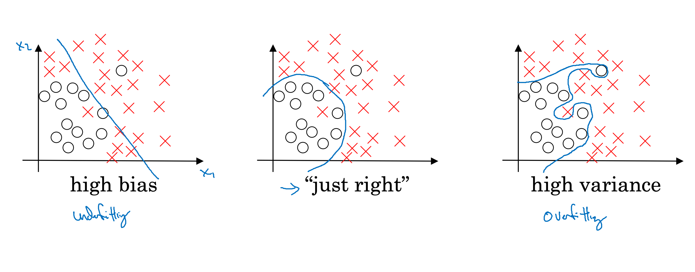
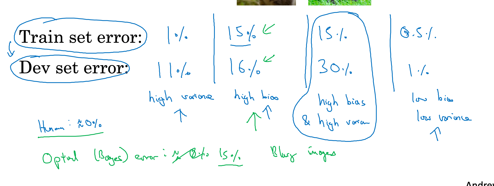
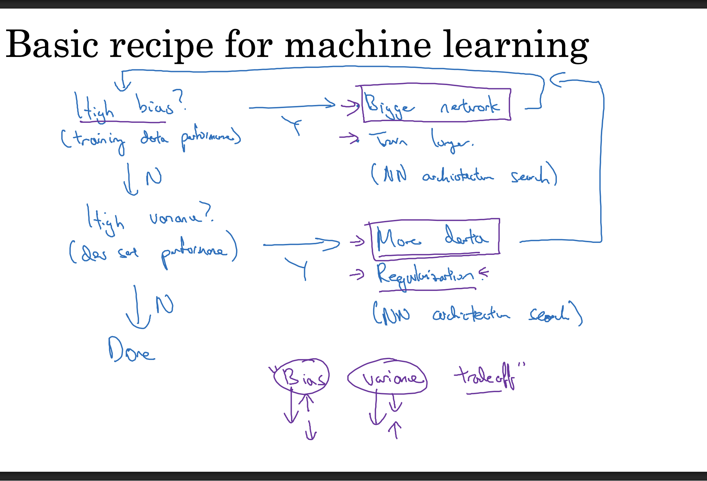
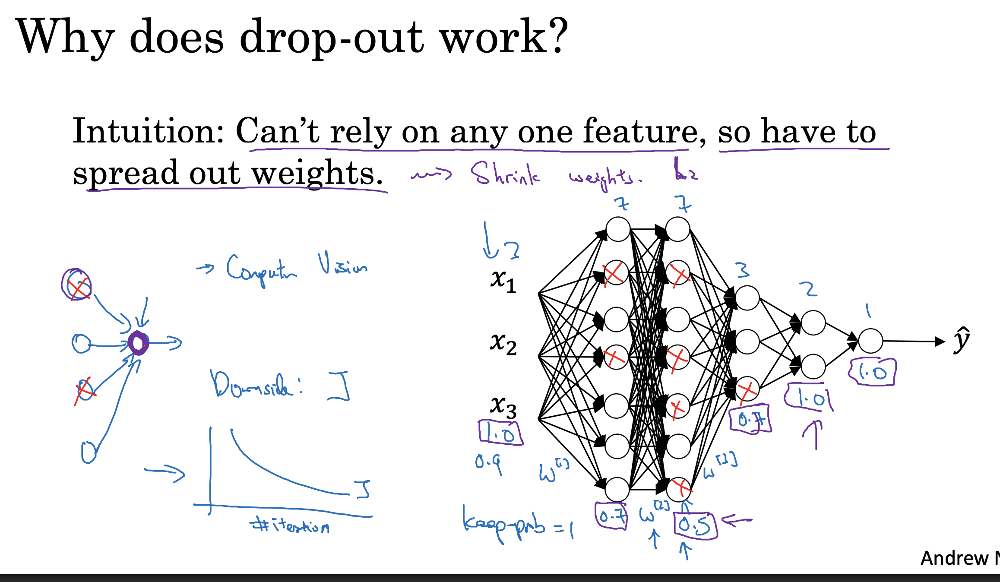
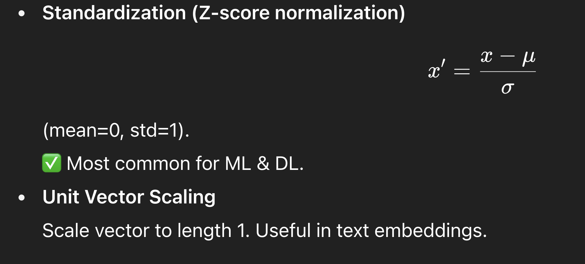
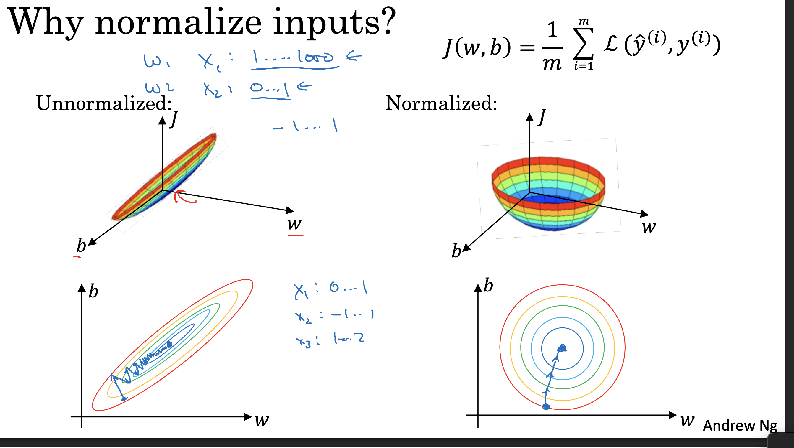
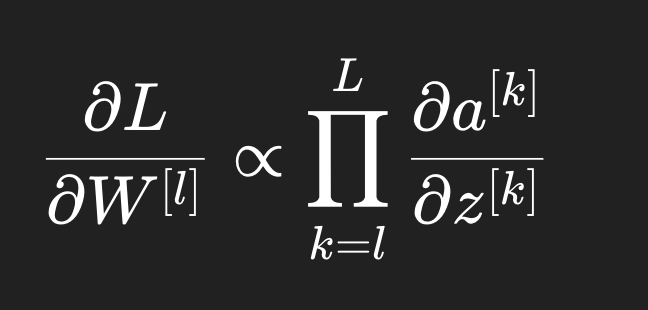

High variance , high bias , low variance & bias [perfect model]

| Aspect             | **High Bias (Underfitting)**                                                                                        | **High Variance (Overfitting)**                                                                                                                                             | **Low Bias & Low Variance (Ideal)**                              |
| ------------------ | ------------------------------------------------------------------------------------------------------------------- | --------------------------------------------------------------------------------------------------------------------------------------------------------------------------- | ---------------------------------------------------------------- |
| **Cause**          | Model too simple (low capacity), wrong assumptions (e.g. linear model for nonlinear data).                          | Model too complex (too many parameters), too flexible (e.g. deep tree, huge NN with no regularization).                                                                     | Balanced model complexity + enough data.                         |
| **Training Error** | High (can’t even fit training data well).                                                                           | Low (fits training data almost perfectly).                                                                                                                                  | Low (fits training data well but not perfectly).                 |
| **Test Error**     | High (fails on both training & unseen data).                                                                        | High (does well on training but poor on unseen data).                                                                                                                       | Low (generalizes well to unseen data).                           |
| **Model Behavior** | Oversimplifies, misses important patterns.                                                                          | Memorizes noise, too sensitive to fluctuations in training data.                                                                                                            | Captures patterns, ignores noise, generalizes well.              |
| **Example**        | Linear regression on a quadratic dataset.                                                                           | Very deep decision tree without pruning.                                                                                                                                    | Moderate-depth tree, regularized NN, or ensemble methods.        |
| **Fixes**          | - Increase model complexity (more layers/features). - Reduce regularization. - Train longer if under-trained. | - Simplify model (reduce parameters). - Use regularization (L1/L2, dropout, early stopping). - Get more training data. - Use cross-validation to tune hyperparams. | Maintain proper tradeoff with model complexity + regularization. |

High bias → fix with a more complex/flexible model (or train longer if under-trained).

High variance → fix with more data + regularization.

More data alone won’t solve bias.

To fix high variance : 
1. Regularization : 

L1 Regualrization and L2 Regularization

Core idea of L1 & L2

Both add a penalty term to the loss function based on the size of the weights.

This discourages the model from relying on very large weights (which usually means the model is overfitting to noise).

🔸 L1 (Lasso)
𝐿
𝑜
𝑠
𝑠
=
𝑂
𝑟
𝑖
𝑔
𝑖
𝑛
𝑎
𝑙
 
𝐿
𝑜
𝑠
𝑠
+
𝜆
∑
∣
𝑤
𝑖
∣
Loss=Original Loss+λ∑∣w
i
	​

∣

Penalizes absolute value of weights.

Effect: pushes many weights exactly to 0 → sparse model.

✅ Good for feature selection (ignores irrelevant inputs).

🔸 L2 (Ridge)
𝐿
𝑜
𝑠
𝑠
=
𝑂
𝑟
𝑖
𝑔
𝑖
𝑛
𝑎
𝑙
 
𝐿
𝑜
𝑠
𝑠
+
𝜆
∑
𝑤
𝑖
2
Loss=Original Loss+λ∑w
i
2
	​

Penalizes square of weights.

Effect: shrinks all weights smoothly, but rarely to zero.

✅ Keeps all features but with small, stable weights.

🔹 Why does penalizing large weights help?

Large weights = model fitting very specific quirks/noise in training data (high variance).

Penalizing them forces the model to keep weights small → decision boundary is smoother → better generalization.

🔹 Analogy

Imagine a curve-fitting problem:

Without regularization: model creates a crazy wiggly curve (huge coefficients on high-degree polynomial terms).

With L2: model keeps coefficients smaller, curve is smoother.

With L1: model kills off irrelevant polynomial terms entirely, leaving only a few important ones.

✅ So yes: L1/L2 = weight penalty to prevent the model from depending on huge weights → reduces overfitting (variance).

🔹 What is Dropout?

During training, randomly “drop” (set to 0) some neurons (with probability p).

This means for each forward pass, the network sees a different “sub-network.”

At test time, all neurons are active, but their outputs are scaled to account for dropout.

👉 Think of it as an ensemble of many smaller networks being trained together.

🔹 Why it Helps (Variance Control)

Prevents co-adaptation of neurons (where some neurons rely too heavily on others).

Forces each neuron to learn more general, independent features.

Acts like averaging many smaller models → improves generalization → lowers variance (overfitting).

🔹 Dropout at Test Time

At test time, we don’t drop neurons — instead, we scale outputs by (1-p) so that the expected activations match training.

Example: if p=0.5, we multiply activations by 0.5 during inference.

Frameworks like PyTorch handle this automatically.

## Other regularization methods 
data augmentation : flip , cut , crop dataset to increase the amount of data to train model 

Early stopping :

🔹 What is it?

A technique to stop training before the model overfits.

Instead of fixing the number of epochs, you monitor performance on a validation set and stop when performance starts to get worse.

👉 Idea: “Don’t let the model memorize the training data — stop while it’s still generalizing well.”

More optimization setups: 

What is Normalization?

Process of adjusting values of features (inputs, activations, etc.) to a common scale.

Goal: make training faster, more stable, and prevent exploding/vanishing gradients.

🔹 Why it helps

Gradient Descent stability → Features on very different scales (e.g. age=20, salary=100000) cause large/small gradients. Normalization balances this.

Faster convergence → Optimizers (SGD, Adam) perform better when inputs have similar ranges.

Better generalization → Prevents one feature dominating others just because of scale.

we can use below technique for normalization

# Vanishing and exploding gradients : 

When training deep neural networks, during backpropagation the gradients (used to update weights) can:

Shrink towards 0 → vanishing gradients.

Grow uncontrollably large → exploding gradients.

Both make training unstable or completely fail.

ackward Pass

The actual vanishing or exploding happens in backprop, because:

If those derivatives are < 1 (sigmoid, tanh) → multiplying many together → vanishing.

If they’re > 1 (large weights, certain activations) → multiplying many together → exploding.

👉 So: vanishing/exploding is a backprop phenomenon.

| Problem                | Causes                                                              | Fixes                                                                    |
| ---------------------- | ------------------------------------------------------------------- | ------------------------------------------------------------------------ |
| **Vanishing Gradient** | Saturating activations (sigmoid/tanh), small derivatives, deep nets | ReLU/variants, Xavier/He init, BatchNorm, Residual connections, LSTM/GRU |
| **Exploding Gradient** | Large weights, deep nets, long sequences                            | Gradient clipping, small LR, weight decay, BatchNorm, careful init       |

