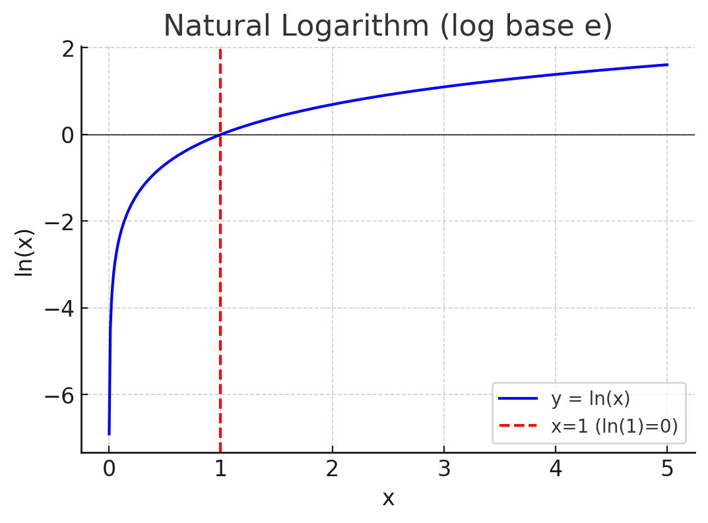

# Why Linear and Activation Functions Are Important in Neural Networks

## 1. The Linear Transformation Step ($Z = W X + b$)

* **Mixes inputs**: Each neuron learns weighted combinations of inputs instead of looking at them individually.
* **Shifts decision boundaries**: Bias terms allow translation of boundaries (not just rotation/scale).
* **Learns interactions**: By combining multiple features ($x_1, x_2, \dots$), the network can detect patterns like “if $x_1$ is high **and** $x_2$ is low, activate.”

```
Input space (x1, x2):

+----------+          Linear mix: rotate/tilt boundary
|          |          Example: z = w1*x1 + w2*x2 + b
|   •      |  --->    Line: w1*x1 + w2*x2 = 0
|          |          
+----------+
```

---

## 2. The Activation Function Step ($A = g(Z)$)

* **Injects nonlinearity**: Prevents the network from collapsing into a single linear function.
* **Enables hierarchy**: Layers build progressively complex features (edges → shapes → objects).
* **Controls signal range**: Keeps outputs stable (e.g., sigmoid in \[0,1], tanh in \[–1,1]).
* **Shapes decision boundaries**:

  * ReLU → sharp, piecewise linear regions.
  * Sigmoid/tanh → smooth probability-like outputs.

```
Linear boundary only:
 ---------------------

 Nonlinear with activation (e.g., circle, XOR):
   ( )
  (   )
   ( )
```

---

## 3. Why Both Are Needed Together

* **Linear-only network**:
  Multiple linear layers collapse into a single linear map → no added power.

  $$
  W^{[2]}(W^{[1]}X + b^{[1]}) + b^{[2]} = W'X + b'
  $$

* **Activation-only network (no linear)**:
  Each neuron just applies nonlinearity to one input dimension.
  → No feature mixing, no meaningful decision boundaries.

```
Case: Activation-only
x1 -> tanh(x1)
x2 -> tanh(x2)
(Just squashes axes, no interaction)
```

* **Linear + Activation alternated**:

  * Linear → “What mixture of features should I look at?”
  * Activation → “Should I fire based on that mixture?”
    Together, they make neural networks **universal approximators** capable of learning any nonlinear mapping.

```
[Inputs] --Linear--> [Z] --Activation--> [A]
     Mix features           Bend space

Result: curved/complex decision boundaries.
```

---

## 4. Key Takeaways

* Linear transformations let neurons **combine and orient features**.
* Activations let networks **bend, curve, and shape decision boundaries**.
* Without either, hidden layers lose meaning and the network can’t solve complex problems.
* Together, they give neural networks their power to approximate real-world functions.

👉 **Analogy:**

* **Linear layer** = rotate/stretch the input space.
* **Activation** = bend/squash it into nonlinear shapes.
* **Stacking them** = flexible, powerful decision boundaries (circles, XOR, spirals, images, language).


## GRAPH OF LOG E
